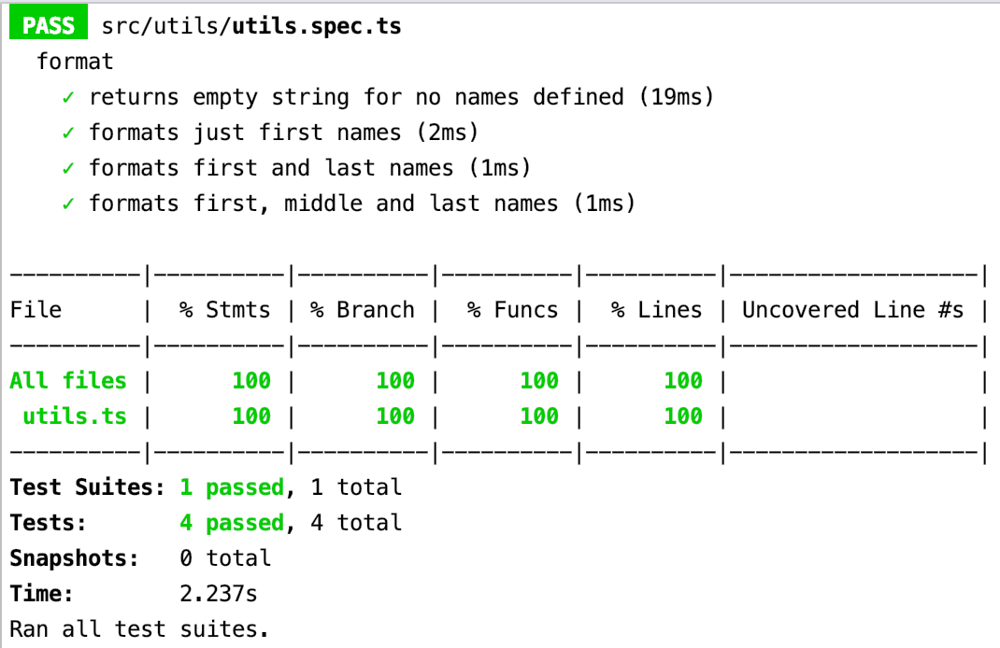

## Dokumentation zur Nutzung der Test Coverage von Jest

### Vorbereitung

Bevor mit der Test Coverage Jest gearbeitet werden kann,
ist das Node Package Modul in die devDependencies zu installieren.

    npm install --save-dev jest
    
Außerdem wird für das Nutzen der Typen (https://www.npmjs.com/package/@types/jest), 
die Jest definiert, auch das entsprechende NPM Modul benötigt.

    npm install --save @types/jest
    
Des Weiteren ist es möglich, die Jest-CLI (https://jestjs.io/docs/en/cli) zu installieren und entsprechend
mit den Kommandos, die Test Coverage zu starten.

Das vorliegende Projekt wurde mit Stencil () aufgesetzt. Stencil bringt in den Befehl
    
    npm run test
    
bereits mit. Um nun die Coverage zu starten, wird der nachfolgende Befehl auf der Kommandozeile
ausgeführt:

    npm run test --coverage
    
In der Kommandozeile erscheint nun eine Übersicht, welche Tests
entsprechend prozentual abgedeckt sind.

In dem Projekt wird nun automatisch ein Ordner, 
der sich coverage nennt, generiert.
Es ist möglich, die Test-Coverage im Browser aufzurufen.

    coverage > Icov-report > index.html
    

Nun ist es auch möglich, die Testabdeckung einzeln getestete Dateien
einzusehen.

Es ist zu sehen, wie oft Funktionen getestet wurden. (Hier der Rückgabewert 4x).