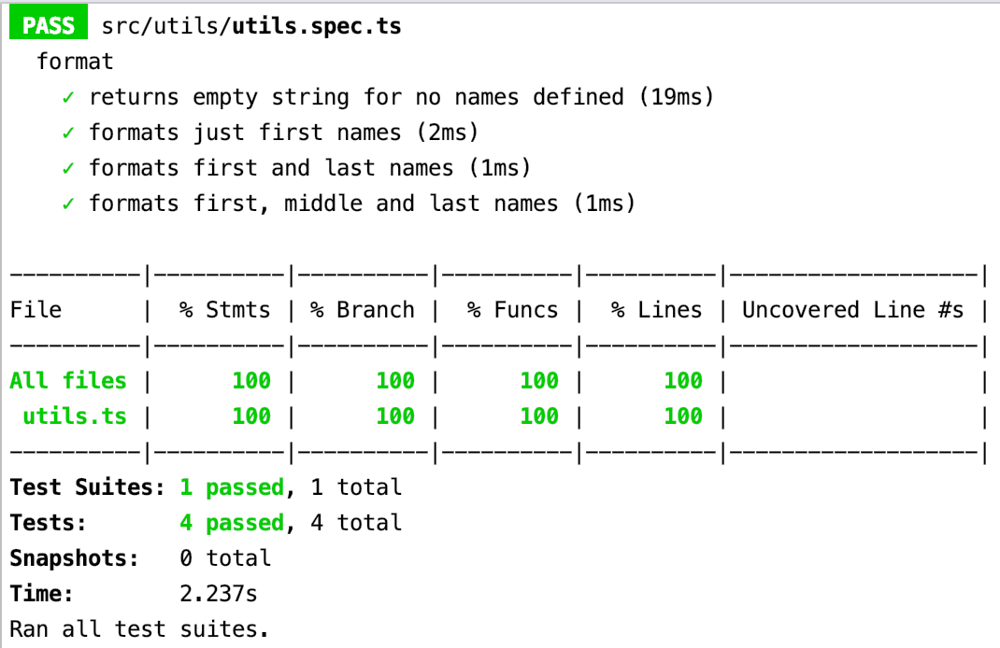
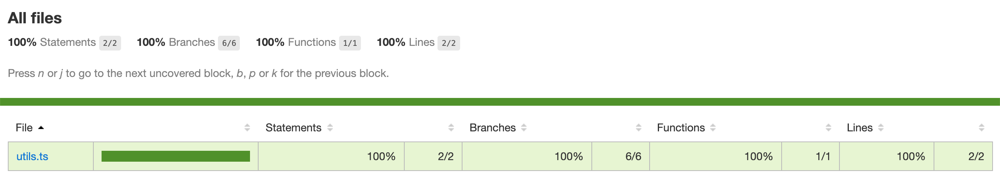
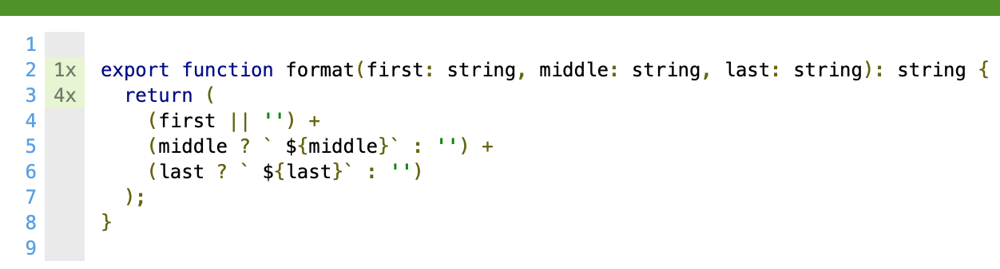
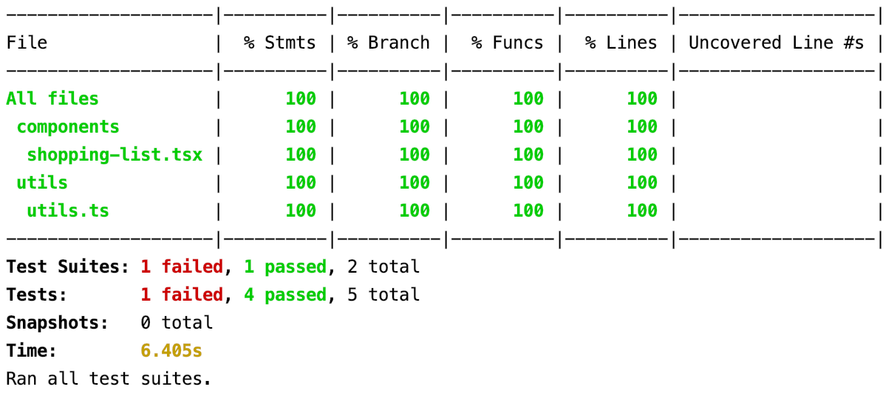
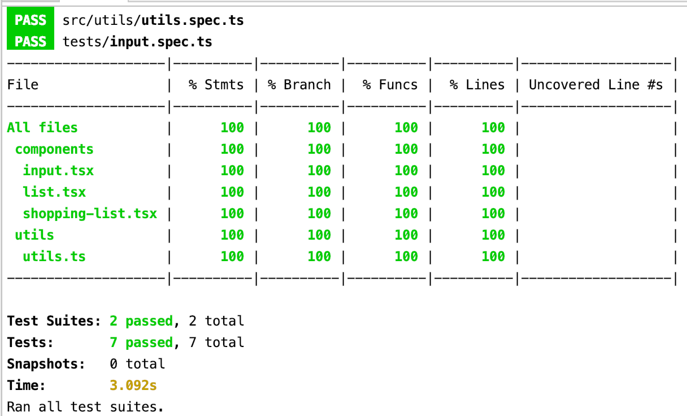
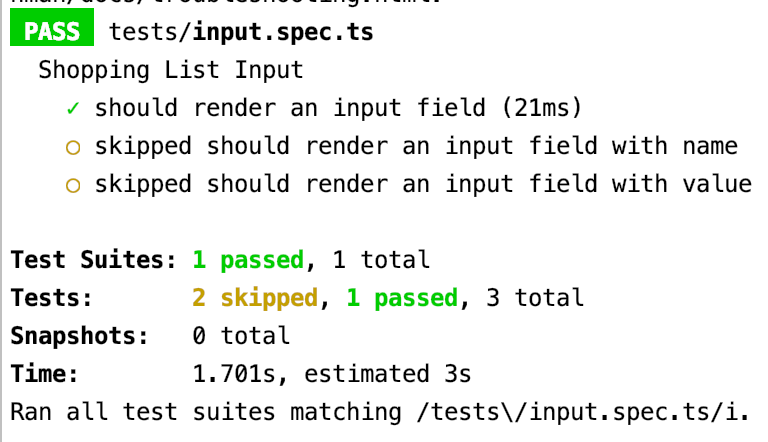

## Dokumentation zur Nutzung der Jest-Test Coverage

Jest ist ein JavaScript Test-Framework, das den Schwerpunkt auf Einfachheit legt. Es funktioniert
mit Projekten die Babel, TypeScript, Node, React, Angular, Vue 
uvm. verwenden.

### Vorbereitung

Bevor mit der Test Coverage Jest gearbeitet werden kann,
ist das Node Package Modul in die devDependencies zu installieren.

    npm install --save-dev jest
    
Außerdem wird für das Nutzen der Typen (https://www.npmjs.com/package/@types/jest), 
die Jest definiert, auch das entsprechende NPM Modul benötigt.

    npm install --save @types/jest
    
Des Weiteren ist es möglich, die Jest-CLI (https://jestjs.io/docs/en/cli) zu installieren und entsprechend
mit den Kommandos, die Test Coverage zu starten.

### Ausführung

Das vorliegende Projekt (https://github.com/wesade/VWsM/tree/master/UE3-CCD/shopping-list)
wurde mit Stencil (https://stenciljs.com/) aufgesetzt. Stencil bringt den Befehl
    
    npm run test
    
bereits mit. Um nun die Coverage zu starten, wird der nachfolgende Befehl auf der Kommandozeile
ausgeführt:

    npm run test --coverage
    
In der Kommandozeile erscheint eine Übersicht, die anzeigt, welche Tests
entsprechend prozentual abgedeckt sind. Durch das Projekt-Setup mit Stencil
werden hier bereits vier Tests ausgeführt.

In dem Projekt wird nun automatisch ein Ordner, 
der sich coverage nennt, generiert.
Es ist dann auch möglich, die Test-Coverage im Browser aufzurufen.

    coverage > Icov-report > index.html
    

Des Weiteren kann die Testabdeckung einzeln getesteter Dateien
eingesehen worden sind.

Es ist zu sehen, wie oft einzelne Codezeilen getestet wurden.

### Das eigene Projekt

Für das Projekt Shopping-List (https://github.com/wesade/VWsM/tree/master/UE3-CCD/shopping-list)
wurde nun ein erster Test angelegt. In dem vorliegenden Projekt wird die Designstrategie der testgetriebenen Entwicklung angewandt.
    
    describe('Shopping List Input', () => {
        it('should render an input field', async () => {
            const page = await newSpecPage({ components: [ShoppingList] });
    
            await page.setContent(`
                <shopping-list>
                </shopping-list>
            `);
    
            expect(page.root.shadowRoot.querySelector('shopping-list').querySelector('input')).toHaveAttribute('type');
        });
    });
    
Wenn nun die Code-Coverage ausgeführt wird, ist zu sehen, dass ein Test fehl geschlagen ist, jedoch 
eine 100%ige Testabdeckung vorliegt:

Das heißt, dass die Implementierung noch nicht korrekt ist, aber alle Codezeilen mit diesem Test abgedeckt sind.

Im Terminal wird der Fehler angezeigt, der für das Fehlschlagen des Tests sorgt:

     Shopping List Input › should render an input field
    
        TypeError: Cannot read property 'querySelector' of null
    
          11 |         `);
          12 | 
        > 13 |         expect(page.root.shadowRoot.querySelector('.shopping-list').querySelector('input')).toHaveAttribute('type');
             |                                                                   ^
          14 |     });
          15 | });
    
          at Object.it (tests/input.spec.ts:13:67)

Um den Test nun erfolgreich auszuführen, wird der
entsprechende Quellcode implementiert:

    export const InputField = ( { name, value } ) => {
        return <input type="text" name={name} value={value} />
    };

Werden die Test erneut ausgeführt, ist zu sehen, dass der oben dokumentierte Fehler behoben ist.

### Hinweis

Wenn in einer Datei mehrere Tests implementiert sind und ggf. durch eine Codeimplementierung fehl schlagen, 
kann dies sehr unübersichtlich werden.
Es besteht dann die Möglichkeit, bestimmte Tests zu deaktivieren, indem ein x an den auszuführenden
Test vorangestellt wird.

    xit('should render an input field with value' ...);
    xdescribe('Shopping List Input',...);
    
Alternativ ist es auch möglich, nur einzelne Tests auszuführen. In diesem Fall wird das Schlüsselwort *only* genutzt.

    it.only('should render an input field with value' ...);
    describe.only('Shopping List Input',...);

Zu beachten ist bei Stencil jedoch, dass in der *package.json* nur die zu testende Datei
in dem entsprechenden Test-Befehl angegeben ist.

    "test": "stencil test --spec tests/input.spec.ts",   
    
Im Terminal werden dann nur die Tests ausgeführt, die mit dem Schlüsselwort *only* versehen sind.
Alle weiteren Tests werden übersprungen, wie in dem Bild zu sehen ist.

    
### Erfahrungen

Bereits durch die umfangreiche Praxis im Büro meines Arbeitgebers, konnte ich umfassende Kenntnisse und Erfahrungen 
im Umgang mit der Jest-Test Coverage sammeln. Der Aussage, dass Jest den Schwerpunkt auf Einfachheit legt, kann ich
zustimmen. Oftmals habe ich auch die Erkenntnis gewonnen, dass es sinnvoll ist, eine umfangreiche und ausreichende
Testabdeckung zu schaffen, da besonders so Fehler in der Implementierung vermieden werden können 
(Stichwort Test-Driven-Development). 

Wenn Zeitdruck besteht und ein Release an eine Frist gebunden ist, werden unter Anderem Tests weg gelassen. 
Diese werden dann im Nachgang implementiert und haben bereits schon Fehlimplementierungen aufgedeckt.

Kurz und knapp würde ich dazu sagen: "Tests gurten den Quellcode fest."